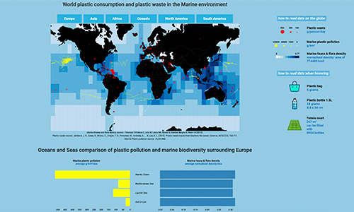

# The lives of our single use plastics within the marine flora and fauna in 2010

We use plastic consumption, ocean plastic pollution and sea and ocean biodiversity data to show the cohabitation of marine flora and fauna with plastics. We built an interactive world map and histogram to observe the biodiversity richness next to plastic consumption and pollution.

# La vie de nos plastique à usage unique dans la flore et faune marine en 2010

Nous utilisons des données sur la consommation plastique, la pollution plastique des océans et la biodiversité des mers et océans pour montrer la cohabitation de la faune et flore marine avec les plastiques. Nous avons réalisé une carte du monde interactive pour observer la richesse de la biodiversité à côté de la consommation et pollution plastique.

  

\
\
\
Jonathan Pattin Cottet  
Eyosyas Abebe  
Simon Verdu  
Florian Gaspard  

https://lyondataviz.github.io/teaching/lyon1-m2/2020  
Université Claude Bernard Lyon 1  
Master Data Science 2020
